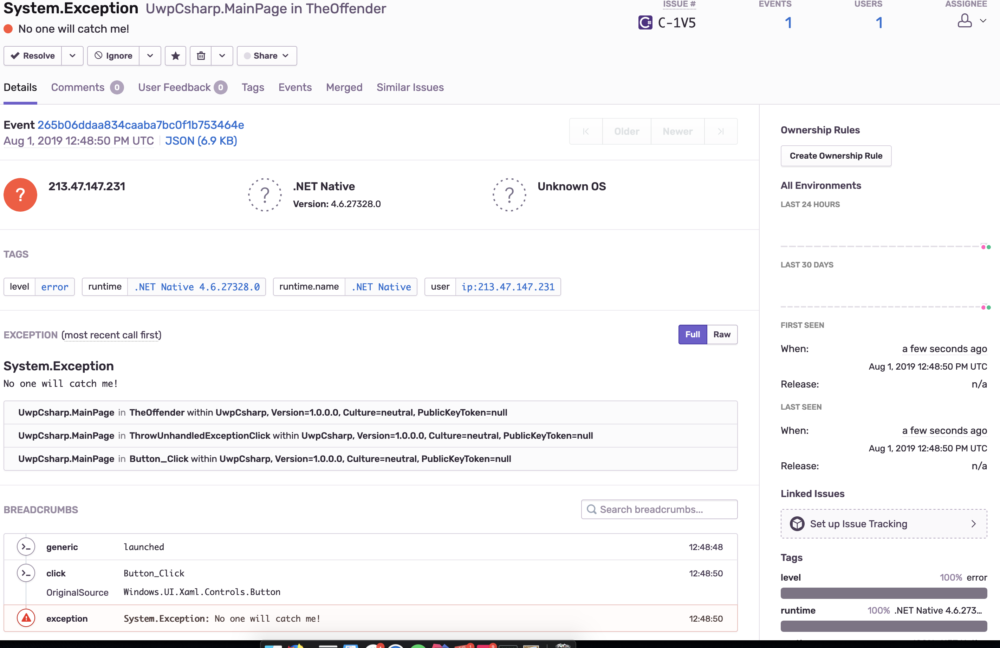

UnhandledException is not captured at the time.

Handled is captured in Debug and Release builds, fired up from within Visual Studio and also _Deployed_ to Windows 10.
With PDB available the stack trace is correctly sent from the client:

